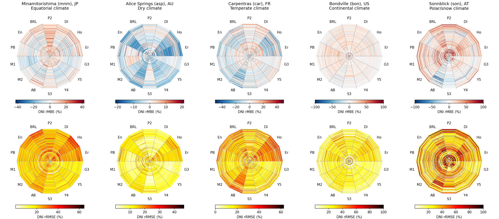
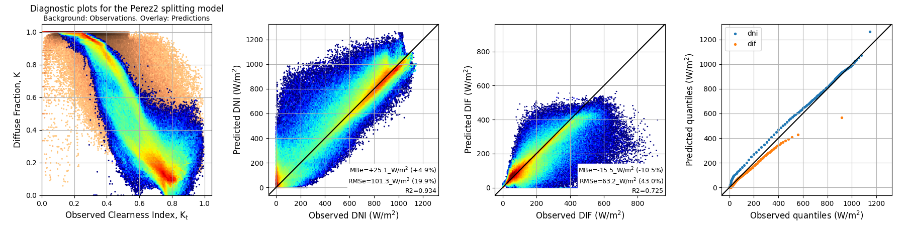
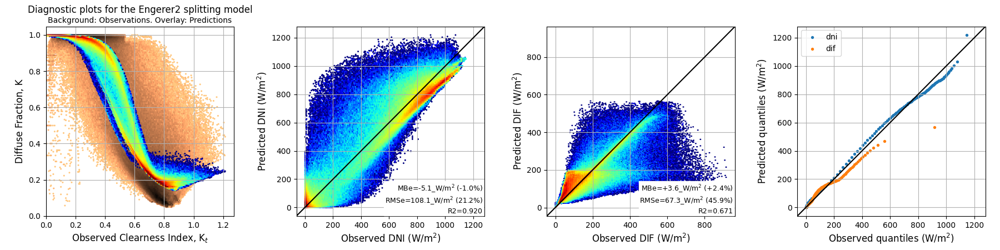
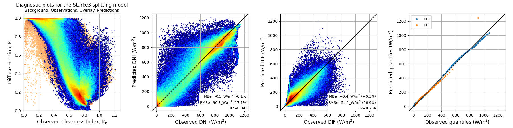
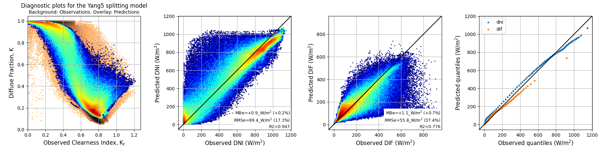
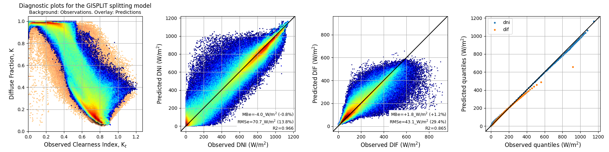

# Global solar irradiance components separation models

<p align="center">
<figure>
    
    <figcaption><em>Error metrics for DNI predicted by 14 separation models (angular dimension) for five BSRN stations. The radial dimension is the day of the year.</em></figcaption>
</figure>
</p>

A common-interface library for state-of-the-art (and some others) global solar irradiance components separation models. It was developed while working on the following paper:

> Ruiz-Arias, J.A., and Gueymard, C.A. (2024) Review and performance benchmarking of 1-min solar irradiance components separation methods: The critical role of dynamically-constrained sky conditions. Submitted for publication to _Renewable and Sustainable Energy Reviews_ 


### Installation

```sh
python3 -m pip install git+https://github.com/jararias/splitting_models@main
```

### Benchmarking

From the command-line interface

```sh
python3 -c "import splitting_models.tests as sm_tests; sm_tests.basic_test()"
```

or rather

```python
import pylab as pl
import splitting_models.tests as sm_tests
sm_tests.basic_test()
pl.show()
```

from a python script. This test/benchmark makes use of a public [dataset](https://github.com/jararias/splitting_models/tree/main#testing-dataset) specifically prepared for this task.

### Usage

To see the available component-separation models:

```python
import splitting_models.models as sm
print(sm.available_models())
```

Currently, the implemented models are: Abreu[^1], BRL[^2], DIRINT[^3], DISC[^4], Engerer2[^5][^6], Erbs[^7], GISPLIT[^8], Hollands[^9], PaulescuBlaga[^10], PaulescuPaulescu1[^11], PaulescuPaulescu2[^11], Perez2[^12], Starke3[^13][^14][^15], Yang4[^16] and Yang5[^17].

[^1]: Abreu, E.F., Canhoto, P., and Costa, M.J. (2019) Prediction of diffuse horizontal irradiance using a new climate zone model. _Renewable and Sustainable Energy Reviews_, 110, 28-42. doi: [10.1016/j.rser.2019.04.055](https://doi.org/10.1016/j.rser.2019.04.055)
[^2]: Ridley, B., Boland, J., and Lauret, P. (2010) Modelling of diffuse solar fraction with multiple predictors. _Renewable Energy_, 35(2), 478-483. doi: [10.1016/j.renene.2009.07.018](https://doi.org/10.1016/j.renene.2009.07.018)
[^3]: Ineichen, P., Perez, R.R., Seal, R.D., Maxwell, E.L., and Zalenka, A.J.A.T. (1992) Dynamic global-to-direct irradiance conversion models. _ASHRAE Trans_, 98(1), 354-369. [pdf](https://access.archive-ouverte.unige.ch/access/metadata/242f6608-0e96-4566-bbb0-450d821670c7/download)
[^4]: Maxwell, E.L. (1987) A Quasi-Physical Model for Converting Hourly Global Horizontal to Direct Normal Insolation, Tech. Rep. SERI/TR-215-3087, Golden, CO, Solar Energy Research Institute. [link](https://www.osti.gov/biblio/5987868)
[^5]: Engerer, N.A. (2015) Minute resolution estimates of the diffuse fraction of global irradiance for southeastern Australia. _Solar Energy_, 116, 215-237. doi: [10.1016/j.solener.2015.04.012](https://doi.org/10.1016/j.solener.2015.04.012)
[^6]: Bright, J.M., and Engerer, N.A. (2019) Engerer2: Global re-parameterisation, update, and validation of an irradiance separation model at different temporal resolutions. _Journal of Renewable and Sustainable Energy_, 11(3). doi: [10.1063/1.5097014](https://doi.org/10.1063/1.5097014)
[^7]: Erbs, D.G., Klein, S.A., and Duffie, J.A. (1982) Estimation of the diffuse radiation fraction for hourly, daily and monthly-average global radiation. _Solar Energy_, 28(4), 293-302. doi: [10.1016/0038-092X(82)90302-4](https://doi.org/10.1016/0038-092X(82)90302-4)
[^8]: Ruiz-Arias, J.A., and Gueymard, C.A. (2024) GISPLIT: High-performance global solar irradiance component-separation model dynamically constrained by 1-min sky conditions. _Solar Energy_, 269, 112363. doi: [10.1016/j.solener.2024.112363](https://doi.org/10.1016/j.solener.2024.112363)
[^9]: Hollands, K.G.T. (1985) A derivation of the diffuse fraction's dependence on the clearness index. _Solar Energy_, 35(2), 131-136. doi: [10.1016/0038-092X(85)90003-9](https://doi.org/10.1016/0038-092X(85)90003-9)
[^10]: Paulescu, E., and Blaga, R. (2019) A simple and reliable empirical model with two predictors for estimating 1-minute diffuse fraction. _Solar Energy_, 180, 75-84. doi: [10.1016/j.solener.2019.01.029](https://doi.org/10.1016/j.solener.2019.01.029)
[^11]: Paulescu, E., Paulescu, M. (2023). Minute-Scale Models for the Diffuse Fraction of Global Solar Radiation Balanced between Accuracy and Accessibility. Applied Sciences, 13(11), 6558. doi: [10.3390/app13116558](https://doi.org/10.3390/app13116558)
[^12]: Perez, R., Ineichen, P., Moore, K., Kmiecik, M., Chain, C., George, R., and Vignola, F. (2002) A new operational model for satellite-derived irradiances: description and validation. _Solar Energy_, 73(5), 307-317. doi: [10.1016/S0038-092X(02)00122-6](https://doi.org/10.1016/S0038-092X(02)00122-6)
[^13]: Starke, A.R., Lemos, L.F., Boland, J., Cardemil, J.M., and Colle, S. (2018) Resolution of the cloud enhancement problem for one-minute diffuse radiation prediction. _Renewable Energy_, 125, 472-484. doi: [10.1016/j.renene.2018.02.107](https://doi.org/10.1016/j.renene.2018.02.107)
[^14]: Starke, A.R., Lemos, L.F., Barni, C.M., Machado, R.D., Cardemil, J.M., Boland, J., and Colle, S. (2021) Assessing one-minute diffuse fraction models based on worldwide climate features. _Renewable Energy_, 177, 700-714. doi: [10.1016/j.renene.2021.05.108](https://doi.org/10.1016/j.renene.2021.05.108)
[^15]: Yang, D. (2022) Estimating 1-min beam and diffuse irradiance from the global irradiance: A review and an extensive worldwide comparison of latest separation models at 126 stations. _Renewable and Sustainable Energy Reviews_, 159, 112195. doi: [10.1016/j.rser.2022.112195](https://doi.org/10.1016/j.rser.2022.112195)
[^16]: Yang, D. (2021) Temporal-resolution cascade model for separation of 1-min beam and diffuse irradiance. _Journal of Renewable and Sustainable Energy_, 13(5). doi: [10.1063/5.0067997](https://doi.org/10.1063/5.0067997)
[^17]: Yang, D., Gu, Y., Mayer, M.J., Gueymard, C.A., Wang, W., Kleissl, J., Mengying L.E., Yinghao C.F. and Bright, J.M. (2024) Regime-dependent 1-min irradiance separation model with climatology clustering. _Renewable and Sustainable Energy Reviews_, 189, 113992. doi: [10.1016/j.rser.2023.113992](https://doi.org/10.1016/j.rser.2023.113992)

To perform the separation, a two-step _get-and-predict_ process is required. The general pattern is:

```python
out_df = sm.get(<model_name>).predict(inp_df, **model_kwargs)
```

where:

- `inp_df` is a Pandas [DataFrame](https://pandas.pydata.org/docs/reference/api/pandas.DataFrame.html) whose required columns depend on the particular model. In general, the required variables (i.e., columns) can be consulted as ```sm.get(<model_name>).__required__``` except for GISPLIT, for which you are referred to [here](https://github.com/jararias/gisplit).
- `out_df` is a Pandas DataFrame with columns `dif` (diffuse irradiance, in W/m$`^2`$), `dir` (direct horizontal irradiance, in W/m$`^2`$) and `dni` (direct normal irradiance, in W/m$`^2`$), with exactly the same index as the input dataframe.

> [!NOTE]
> The input dataframe can be single- or multi-index for multi-site datasets. See [GISPLIT](https://github.com/jararias/gisplit#notes-on-the-input-dataframes-index) for details.

You can quickly explore any model's performance with the `diagnostics` method. The general, pattern is:

```python
sm.get(<model_name>).diagnostics(inp_df, **kwargs)
```

where `kwargs` includes both model-specific keywords and diagnostics options.

### Examples

#### Testing dataset

To provide an easy method to benchmark the models, a subset of the BSRN validation dataset used in the benchmark paper is available in [zenodo](https://zenodo.org/records/10593079). It is easily accessible as:

```python
import splitting_models.tests as sm_tests
data = sm_tests.load_valid_data()
```

The `data` dataframe looks as follows:

```
                             climate  longitude   latitude        sza          eth      ghicda       ghics       difcs  ghi  dif  sky_type
times_utc           site                                                                                                                  
2018-01-01 00:00:30 asp/bsrn       B   133.8880 -23.798000  42.770130  1033.295166  930.346191  739.859985  116.968697  NaN  NaN         1
2018-01-01 00:01:30 asp/bsrn       B   133.8880 -23.798000  42.544128  1037.057495  933.973206  743.021301  117.119797  NaN  NaN         1
2018-01-01 00:02:30 asp/bsrn       B   133.8880 -23.798000  42.318085  1040.804321  937.585693  746.170776  117.269501  NaN  NaN         1
2018-01-01 00:03:30 asp/bsrn       B   133.8880 -23.798000  42.092007  1044.535522  941.183411  749.308228  117.417702  NaN  NaN         1
2018-01-01 00:04:30 asp/bsrn       B   133.8880 -23.798000  41.865887  1048.251099  944.766479  752.433472  117.564598  NaN  NaN         1
...                              ...        ...        ...        ...          ...         ...         ...         ...  ...  ...       ...
2018-12-31 23:55:30 son/bsrn       E    12.9577  47.054001        NaN          NaN         NaN         NaN         NaN  NaN  NaN         1
2018-12-31 23:56:30 son/bsrn       E    12.9577  47.054001        NaN          NaN         NaN         NaN         NaN  NaN  NaN         1
2018-12-31 23:57:30 son/bsrn       E    12.9577  47.054001        NaN          NaN         NaN         NaN         NaN  NaN  NaN         1
2018-12-31 23:58:30 son/bsrn       E    12.9577  47.054001        NaN          NaN         NaN         NaN         NaN  NaN  NaN         1
2018-12-31 23:59:30 son/bsrn       E    12.9577  47.054001        NaN          NaN         NaN         NaN         NaN  NaN  NaN         1

[2628000 rows x 11 columns]
```

This dataset contains 1 year of data from each of 5 different BSRN stations, with different primary Koeppen-Geiger climates (MNM, Minamitorishima, Japan, climate A, tropical; ASP, Alice Springs, Australia, climate B, dry; CAR, Carpentras, France, climate C, temperate; BON, Bondville, United States, climate D, continental, and SON, Sonnblick, Austria, climate E, polar), totalling &asymp;1 Mill. valid data points (i.e., not-nan data points).

> [!NOTE]
> The CAELUS sky type (for GISPLIT) has been already pre-computed. Hence, the `ghicda` column is not required by CAELUS (nor `longitude`, although it is included here because it is needed by other separation models).

> [!NOTE]
> The dataset includes a columns for the primary Koeppen-Geiger climate for each site, which is required by Abreu and Starke3 (optionally, by GISPLIT).

#### Simple prediction

```python
pred = sm.get('Erbs').predict(data)
print(pred.dropna())
```

that results in:

```
                                     dif         dir         dni
times_utc           site                                        
2018-01-01 00:08:30 asp/bsrn  323.774621   26.225379   34.728449
2018-01-01 00:09:30 asp/bsrn  328.419217   28.580783   37.718515
2018-01-01 00:14:30 asp/bsrn  352.103716  202.896284  263.336417
2018-01-01 00:15:30 asp/bsrn  317.935914  297.064086  384.301573
2018-01-01 00:16:30 asp/bsrn  349.886475  218.113525  281.255439
...                                  ...         ...         ...
2018-12-31 14:40:30 son/bsrn   29.391695    0.608305    6.325692
2018-12-31 14:41:30 son/bsrn   29.369366    0.630634    6.709077
2018-12-31 14:42:30 son/bsrn   27.454068    0.545932    5.945499
2018-12-31 14:43:30 son/bsrn   26.480014    0.519986    5.800739
2018-12-31 14:44:30 son/bsrn   25.505751    0.494249    5.651628

[1007064 rows x 3 columns]
```

Note that I am only dumping rows without nan values.

#### Prediction with a climate-dependent model

As `climate` is already a column in `data`, the model takes climate information from there:

```python
pred = sm.get('Starke3').predict(data)
```

If the `climate` column is not in `data`, climate C (i.e., temperate) is assumed, and the model will warn us about that:

```python
pred = sm.get('Starke3').predict(data.drop(columns='climate'))
```

which raises: ```UserWarning: climate input missing. Assumed climate `C` ```

Alternatively, we can indicate the climate with the `climate` input argument:

```python
pred = sm.get('Starke3').predict(data.drop(columns='climate'), climate='A')
```

#### Prediction with GISPLIT

As the CAELUS sky type is already included in the column `sky_type`, we can tell GISPLIT to use it instead of performing the classification as part of the separation (to do so, it would also need `ghicda` which is not included in the dataset). Hence:

```python
pred = sm.get('GISPLIT').predict(data, sky_type_or_func=lambda df: df.sky_type.values)
```

As the input dataset includes the `climate` column, GISPLIT would use it to run its climate-specific versions. To prevent it (recommended option), we have to drop that column:

```python
pred = sm.get('GISPLIT').predict(data.drop(columns='climate'), sky_type_or_func=lambda df: df.sky_type.values)
```

If the `climate` column is in `data`, it will use it to run the climate-specific versions. As with the previous models, the site's climate can be forced with the `climate` input argument.

To select the GISPLIT's engine, just past `engine='reg'` or `engine='xgb'` to `predict`. 

#### Diagnostics

As prediction, but changing `predict` by `diagnostics`. For instance:

```python
sm.get('Perez2').diagnostics(data)
```

<p align="center">
    
</p>

```python
sm.get('Engerer2').diagnostics(data)
```

<p align="center">
    
</p>

```python
sm.get('Starke3').diagnostics(data)
```

<p align="center">
    
</p>

```python
sm.get('Yang5').diagnostics(data)
```

<p align="center">
    
</p>

```python
sm.get('GISPLIT').diagnostics(data.drop(columns='climate'), sky_type_or_func=lambda df: df.sky_type.values)
```

<p align="center">
    
</p>


